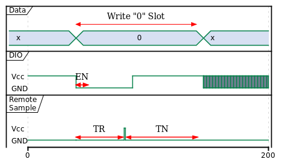
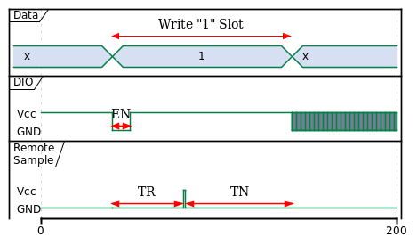
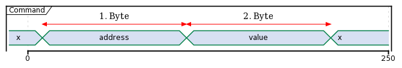
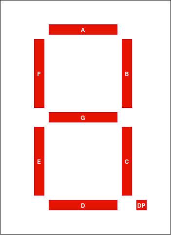

# One Wire Driver for the PIC16F54 7 segments display

The Driver control the display over One Wire bus. The driver can set up the luminosity and shut-down the display. When the driver shutdown the display, the display can only be startup again from poweron or pushing the disable/enable-pin down. 

The "PIC16F54 7 segments display":

- 3 x 7 segments common cathode (5611AS)
- 1 x PIC16F54 Micro-Controller
- 3 x 2n7002 Transistors

## Features

- One wire bus
- Disable/Enable Pin
- Dimming
- Sleep (Energy saving, Then you need two pins) 
- 3 characters

## Schematic

The [Schematic](documents/images/pic16f54-7-segments-display-schematic.pdf) and the 
[board](documents/images/pic16f54-7-segments-display_pcb.pdf) files 

## One Wire Protocol

### Bit Timing

||
|:---:| 
|*Master Write "0" Slot*|

||
|:---:| 
|*Master Write "1" Slot*|

 The Timings have to be updated! Now the values are just fake values 

| Symbol | Description | Min | Typ | Max | Unit |
|:---:|:---|:---|:---:|---:|---:|
| EN | Enable | 10 | 10 | 80 | ms |
| TR | Time to read | 90 | 100 | 110 | ms |
| TN | Time to new bit | 10| 200 | 220 | ms |

EN
: Start of new bit

TR
: Time between start of EN and the remote sample the DIO

TN
: Time the remote spend wait for new Data, this should be bigger than the minimum akllowed time for EN

### Command Operation

||
|:---:| 
|*Command Operation*|

### Registers

| Adresse | Description | Default |
|:--------------|:-------------:|--------------:|
| 0x00 | Option | 0x00 |
| 0x01 | Digit 1 | 0x00 |
| 0x02 | Digit 2 | 0x00 |
| 0x03 | Digit 3 | 0x00 |

#### Option Register Bit Assignement

This register acts as setting register.

| Option | 7 | 6 | 5 | 4 | 3 | 2 | 1 | 0 |
|:---|:-----:|:-----:|:-----:|:-----:|:-----:|:-----:|:-----:|:-----:|
| | SLEEP | <t style="text-decoration:overline">EN</t> | DIM5  | DIM4  | DIM3  | DIM2  | DIM1  | DIM0  |
| Default | 0 | 0 | 0 | 0 | 0 | 0 | 0 | 0 |

DIM<5-0>
: Dimmer, '0b000000' is full power and '0b111111' is dark.

<t style="text-decoration:overline">EN</t>
: Writing '1' to this position will power off the segments. All segments are off, but the controller is still running.
:  <t style="text-decoration:overline">EN</t> isn't implemented yet! 
 
SLEEP
: The controller go in sleep. Can only be restart push the <t style="text-decoration:overline">MCLR</t> pin down. All registers will be reset to theirs default value. 

#### Digit x Register Bit Assignement

Registers describing the segments that should light on. Writing '1' to a position will light on this segments. 

| Bit 7 | Bit 6 | Bit 5 | Bit 4 | Bit 3 | Bit 2 | Bit 1 | Bit 0 |
|:-----:|:-----:|:-----:|:-----:|:-----:|:-----:|:-----:|:-----:|
| DP    | G     | F  | E | D | C | B | A |

||
|:---:| 
|*Seven Segments*|

## To-Do
- [ ] Implement power off the segments (Bit 6 of option register)
- [ ] Update Bit-Timing with the right value

