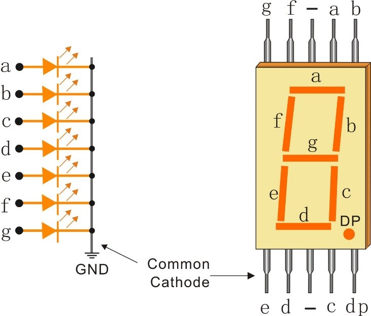

# One Wire Driver for the PIC16F54 7 segments display

The Driver control the display over One Wire bus. The driver can set up the luminosity and shut-down the display. When the driver shutdown the display, the display can only be startup again from poweron or pushing the disable/enable-pin down. 

The "PIC16F54 7 segments display":

- 3 x 7 segments common cathode (5611AS)
- 1 x PIC16F54 Micro-Controller
- 3 x 2n7002 Transistors

## Features

- One wire bus
- Disable/Enable Pin
- 3 characters

## Schematic

The [Schematic](documents/images/pic16f54-7-segments-display-schematic.pdf) and the 
[board](documents/images/pic16f54-7-segments-display_pcb.pdf) files 

## One Wire Protocol

### Bit Timing

| Symbol | Parameter | Value | Unit |
|:--------------|:-------------:|--------------:|--|
| Links | Zentriert | Rechts | ms |
| DL |  |  | ms |
| IL |  |  | ms |
| TR |  |  | ms |
| EN |  |  | ms |

### Command Operation

||
|:--:| 
|*image_caption*|

### Registers

| Adresse | Description | Default |
|:--------------|:-------------:|--------------:|
| 0x00 | Option | 0x00 |
| 0x01 | Digit 1 | 0x00 |
| 0x02 | Digit 2 | 0x00 |
| 0x03 | Digit 3 | 0x00 |

#### Option Register Bit Assignement

| Bit 7 | Bit 6 | Bit 5 | Bit 4 | Bit 3 | Bit 2 | Bit 1 | Bit 0 |
|:-----:|:-----:|:-----:|:-----:|:-----:|:-----:|:-----:|:-----:|
| SLEEP | <t style="text-decoration:overline">EN</t> | LUM5  | LUM4  | LUM3  | LUM2  | LUM1  | LUM0  |

#### Digit x Register Bit Assignement

| Bit 7 | Bit 6 | Bit 5 | Bit 4 | Bit 3 | Bit 2 | Bit 1 | Bit 0 |
|:-----:|:-----:|:-----:|:-----:|:-----:|:-----:|:-----:|:-----:|
| DP    | G     | F  | E | D | C | B | A |

https://www.sunfounder.com/media/wysiwyg/swatches/super-kit-v2-for-Arduino/10_7_seg_display/cathe.jpg

https://www.electronics-tutorials.ws/blog/7-segment-display-tutorial.html